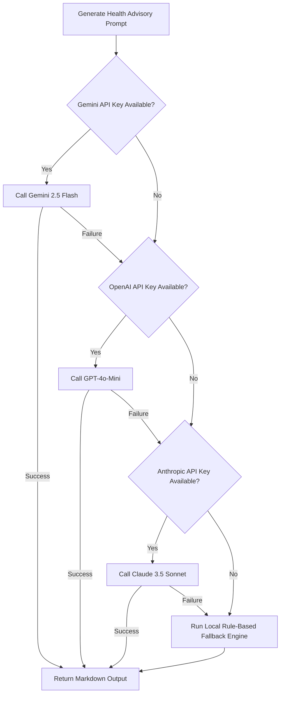

# 🌍 AQI Decision Intelligence Platform - Comprehensive Project Documentation & Conceptual Architecture

This document provides an exhaustive, highly detailed technical manual of the **AQI Decision Intelligence Platform**. It covers the end-to-end architecture, underlying mathematical formulations, machine learning methodologies, meteorological factors, API designs, load balancing, and production scaling strategies.

---

## 📂 Project Architecture & File Structure

The project is structured as a decoupled system featuring a **Streamlit Frontend Dashboard** and a **FastAPI REST API Backend**, backed by a Scikit-Learn machine learning model and a multi-provider LLM decision router.

```
aqi-prediction-platform/
├── app.py                  # Streamlit Dashboard (stateful client UI, styling, and charts)
├── api.py                  # FastAPI REST API (prediction and live data routing)
├── live_data.py            # Data Ingestion Client (AQICN Global API wrapper)
├── forecast_engine.py      # Forecasting, aggregation, and trend analytics
├── ai_advisor.py           # Multi-provider REST router (Gemini, OpenAI, Anthropic, Fallback)
├── train_model.py          # Machine Learning training pipeline (data generation & training)
├── requirements.txt        # Python dependency manifest
├── aqi_data.csv            # Training dataset containing pollutant sub-indices
├── aqi_model.pkl           # Trained Random Forest Regressor model
├── scaler.pkl              # Scaled feature metadata (StandardScaler)
└── .streamlit/
    ├── config.toml         # Streamlit UI theme configuration
    └── secrets.toml        # Local API credentials (git-ignored)
```

---

## ⚙️ Core Technical Concepts

### 1. Real-Time Data Ingestion (`live_data.py`)
- **API Grounding**: Rather than relying on simulated inputs or static datasets, the platform pulls real-time environmental metrics from the **World Air Quality Index (AQICN) API** (`https://api.waqi.info/feed`).
- **Data Extractor**: The ingestion client queries the feed for a given city and parses the nested JSON payload to extract individual pollutant sub-indices, including:
  - Carbon Monoxide ($CO$)
  - Ozone ($O_3$)
  - Nitrogen Dioxide ($NO_2$)
  - Fine Particulate Matter ($PM_{2.5}$)
- **Caching (`@st.cache_data`)**: To prevent hitting rate limits and to optimize response times, the fetched data is cached for **600 seconds (10 minutes)**.

### 2. Multi-Day Forecast Analytics (`forecast_engine.py`)
- **Aggregation**: The AQICN feed delivers forecast projections per pollutant (including minimum, maximum, and average values). The engine pivots this data by date.
- **Unified Estimation**: The daily overall AQI is estimated using the **maximum sub-index method** (standard EPA approach, where the worst-acting pollutant determines the AQI for that day):
  $$\text{Overall AQI Est.} = \max_{p} (\text{pollutant}_{p,\text{avg}})$$
- **Trend Detection**: By comparing the first and last days of the forecast period, the system classifies the trend direction:
  $$\Delta = AQI_{\text{last}} - AQI_{\text{first}}$$
  $$\text{Trend} = \begin{cases} 
    \text{"rising"} & \text{if } \Delta > 8 \\
    \text{"falling"} & \text{if } \Delta < -8 \\
    \text{"stable"} & \text{otherwise}
  \end{cases}$$

### 3. Decoupled REST APIs (`api.py`)
- **FastAPI Implementation**: Exposes two primary high-performance endpoints:
  - `POST /predict`: Receives sub-index inputs, standardizes features, evaluates the Random Forest model, classifies the index, and invokes the LLM failover router to output a personalized health advisory.
  - `GET /live/{city}`: Ingests live data for a city, runs the ML prediction to cross-reference reported AQI, and returns detailed metrics + an AI advisory.
- **Pydantic Validation**: Ensures strong typing, constraints (e.g., pollutant values must be $\ge 0$), and autogenerated OpenAPI documentation (`/docs`).

### 4. Interactive UX Design (`app.py`)
- **Glassmophic CSS Overlays**: Integrates modern custom CSS with backdrop-blur, linear gradients, and micro-animations (such as 3D-hover lifts and scaling on metric cards) to achieve a premium visual appearance.
- **Segmented Stateful Navigation**: Streamlit scripts normally rerun from top to bottom on any user action, which can reset user input. This project implements a segmented navigation structure using Streamlit's `st.session_state` to maintain tab persistence (`Live City AQI`, `Forecast`, `Ask AI`) without client-side resets.

---

## 🧮 Mathematics & Machine Learning Pipeline

### 1. Air Quality Index (AQI) Piecewise Formulation
The AQI is a piecewise linear interpolation of pollutant concentrations based on standard breakpoints set by environmental protection agencies (like the US-EPA). The mathematical formula for a sub-index $I_p$ of a pollutant concentration $C_p$ is:
$$I_p = \frac{I_{\text{high}} - I_{\text{low}}}{C_{\text{high}} - C_{\text{low}}} (C_p - C_{\text{low}}) + I_{\text{low}}$$
Where:
- $C_p$ is the pollutant concentration.
- $C_{\text{low}}, C_{\text{high}}$ are the concentration breakpoints surrounding $C_p$.
- $I_{\text{low}}, I_{\text{high}}$ are the corresponding AQI breakpoints.

The overall air quality index is defined as:
$$AQI = \max(I_{\text{CO}}, I_{\text{O}_3}, I_{\text{NO}_2}, I_{\text{PM}_{2.5}})$$

---

### 2. Feature Preprocessing
Before feeding pollutant values into the model, the features are normalized using **StandardScaler** (z-score standardization) to ensure uniform weight distribution:
$$z = \frac{x - \mu}{\sigma}$$
Where:
- $x$ represents the raw sub-index value.
- $\mu$ is the mean of that feature across the training set.
- $\sigma$ is the standard deviation of that feature.

This scaling is saved as `scaler.pkl` and applied in real-time to incoming query vectors.

---

### 3. Random Forest Regressor Model
The machine learning component leverages a **Random Forest Regressor** to map the relationship between pollutant sub-indices and the final AQI score:
- **Mathematical Form**:
  $$\hat{y}(x) = \frac{1}{M} \sum_{i=1}^M T_i(x)$$
  Where $M$ is the number of decision trees ($M = 200$), and $T_i(x)$ is the prediction of the $i$-th decision tree trained on a bootstrap sample of the dataset.
- **Hyperparameters**:
  - `n_estimators = 200`: Optimizes stability and reduces variance.
  - `min_samples_split = 4` & `min_samples_leaf = 2`: Prevents overfitting to training outliers.
  - `n_jobs = -1`: Distributes tree building across all available CPU cores.

#### 📈 Baseline Model Performance Metrics:
Upon splitting the dataset (80% train / 20% test), the model evaluation yields:
- **Mean Absolute Error (MAE)**: `7.3753` (Average absolute difference between predictions and actual values)
- **Mean Squared Error (MSE)**: `83.6984`
- **Root Mean Squared Error (RMSE)**: `9.1487`
- **Coefficient of Determination ($R^2$)**: `0.8834` (The features explain **88.34%** of the variance in AQI)

#### 🔍 ML Feature Importance Weights:
The model dynamically computes feature importance, indicating which pollutant contributes most heavily to the predicted AQI:
1. **PM 2.5 (`pm2.5 aqi value`)**: `0.8625` (86.25% - Primary predictor)
2. **CO (`co aqi value`)**: `0.0584` (5.84%)
3. **Ozone (`ozone aqi value`)**: `0.0560` (5.60%)
4. **NO₂ (`no2 aqi value`)**: `0.0231` (2.31%)

---

## 🌡️ Meteorological Variables & AQI Values

Air quality is heavily influenced by meteorological parameters. While the platform directly ingests pollutants, understanding the correlation with weather values is crucial:

### 1. Temperature Inversions (Thermal Inversions)
Normally, warmer air is near the surface and cooler air is above, allowing pollutants to rise and disperse. In a **thermal inversion**:
- A layer of warm air settles above cool air near the surface, acting as a "lid".
- Pollutants (especially $PM_{2.5}$ and $NO_2$) are trapped in the lower layer, leading to a sudden, rapid rise in AQI.

### 2. Ozone Photochemistry & Temperature
Ground-level Ozone ($O_3$) is a secondary pollutant created by the reaction of Nitrogen Oxides ($NO_x$) and Volatile Organic Compounds (VOCs) in sunlight:
$$\text{NO}_x + \text{VOCs} + \text{Sunlight (UV)} \longrightarrow \text{O}_3$$
- **Temperature effect**: Higher ambient temperatures speed up this reaction. On hot, stagnant, sunny days, Ozone levels spike, causing the sub-index to dominate the AQI.

### 3. Wind Dispersion & Stagnation
- High winds dilute pollutant concentrations through turbulent mixing.
- Low winds (stagnant conditions) prevent dispersion, causing local pollutant concentrations to accumulate.

### 4. Humidity & Precipitation
- **Wet Deposition**: Rainfall cleans the atmosphere by washing out large particulate matter and soluble gases.
- **Secondary Aerosols**: High relative humidity can facilitate chemical reactions that transform gaseous emissions into secondary $PM_{2.5}$ aerosols.

### 5. US-EPA AQI Index Reference Table
| AQI Range | Category | Color Hex | Health Advisory Action Summary |
| :--- | :--- | :--- | :--- |
| **0 - 50** | Good | `#059669` | Air quality is satisfactory. Outdoor activities are highly encouraged. |
| **51 - 100** | Moderate | `#d97706` | Acceptable air quality. Extremely sensitive individuals should monitor symptoms. |
| **101 - 150** | Unhealthy for Sensitive | `#ea580c` | Sensitive groups (asthma, children, elderly) should limit outdoor exertion. |
| **151 - 200** | Unhealthy | `#dc2626` | Everyone should reduce outdoor activity; sensitive groups avoid it. |
| **201 - 300** | Very Unhealthy | `#9333ea` | Health alert. Avoid outdoor exertion; run indoor air purifiers. |
| **301 - 500** | Hazardous | `#be123c` | Emergency conditions. Stay indoors, keep windows shut, wear N95 if exiting. |

---

## 🤖 Silent Auto-Failover LLM Routing
To guarantee high-availability conversational decision intelligence, `ai_advisor.py` implements a zero-dependency HTTP client router that attempts model calls in order:



---

## ⚖️ Load Balancing & Production Scaling

Scaling a Streamlit + FastAPI system for thousands of concurrent users requires a specialized infrastructure setup due to the difference in how the two frameworks handle requests.

```
                    ┌────────────────────────┐
                    │     Client Requests    │
                    └───────────┬────────────┘
                                │
                                ▼
                    ┌────────────────────────┐
                    │  Application Load      │
                    │  Balancer (AWS/GCP)    │
                    └─────┬────────────┬─────┘
                          │            │
          (HTTP traffic)  │            │  (WebSocket traffic / sticky sessions)
                          ▼            ▼
                  ┌──────────────┐   ┌───────────────────┐
                  │ FastAPI APIs │   │ Streamlit Front   │
                  │  (Stateless) │   │  (Stateful App)   │
                  └──────┬───────┘   └─────────┬─────────┘
                         │                     │
                         └──────────┬──────────┘
                                    ▼
                          ┌──────────────────┐
                          │   Shared Cache   │
                          │ (Redis / Memory) │
                          └──────────────────┘
```

### 1. Request Handling Mechanics
- **FastAPI (Asynchronous REST API)**: FastAPI is stateless and built on ASGI. Requests are served asynchronously via an event loop. Synchronous execution tasks (such as running the Scikit-Learn `.predict()` method) are offloaded to an internal thread pool so they do not block incoming HTTP traffic.
- **Streamlit (Stateful Web Interface)**: Streamlit initiates a persistent **WebSocket connection** for each user session. When a user changes a search term or clicks a navigation tab, Streamlit reruns the entire python script. Session states are stored in the server's memory.

### 2. Load Balancing Strategies
To deploy this setup in a high-concurrency production environment (e.g., AWS, GCP, or Kubernetes):
1. **WebSocket Handling & Sticky Sessions (Session Affinity)**:
   - Stateless load balancers will round-robin client requests across multiple servers. In Streamlit, this breaks the application because the WebSocket connection will constantly reconnect to different server instances, losing the user's `st.session_state`.
   - **Solution**: Configure the Load Balancer (such as AWS ALB or GCP HTTP(S) Load Balancer) with **Cookie-based Sticky Sessions**. This binds a client to a specific container instance for the duration of their session.
2. **Reverse Proxy (NGINX)**:
   - Place NGINX in front of the application containers to handle SSL/TLS termination, buffer requests, and redirect `/api/` calls directly to the FastAPI container while sending routing traffic to the Streamlit port (`8501`).
   - NGINX configuration must explicitly enable WebSocket upgrades:
     ```nginx
     proxy_set_header Upgrade $http_upgrade;
     proxy_set_header Connection "upgrade";
     ```
3. **Horizontal Pod Autoscaling (K8s)**:
   - Package both Streamlit and FastAPI into separate lightweight Docker containers.
   - Deploy onto Google Kubernetes Engine (GKE) or Amazon EKS.
   - Configure a Kubernetes Ingress Controller to route traffic.
   - Define a Horizontal Pod Autoscaler (HPA) that scales pods up/down based on CPU utilization or active connection count metrics.

### 3. Rate Limiting & Performance Safeguards
- **External API Rate Limiting**: The AQICN API and commercial LLM APIs enforce strict rate limiting.
- **Caching Architecture**: We minimize third-party API exposure by employing memory-efficient caches:
  - `@st.cache_resource` for static assets (ensuring `aqi_model.pkl` is loaded into RAM once, rather than re-read from disk on every script execution).
  - `@st.cache_data(ttl=600)` for live weather queries, preventing repeated API hits for duplicate city searches.
